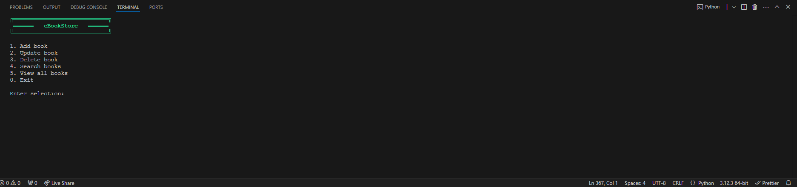
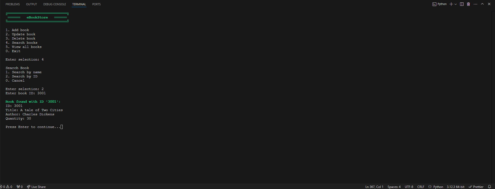
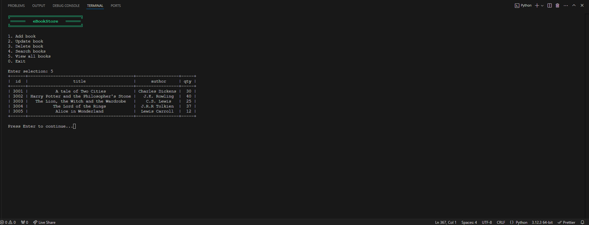

# eBookStore Management System

A command-line interface (CLI) application for managing a bookstore's inventory using SQLite database.

## Features

- Add new books to the inventory
- Update existing book details
- Delete books from the inventory
- Search books by title or ID
- View complete inventory
- Color-coded console output for better user experience
- Database persistence using SQLite

## Prerequisites

- Python 3.10 or higher (for match-case syntax support)
- SQLite3
- Required Python packages:
  ```
  prettytable
  ```

## Installation

1. Clone this repository:

   ```bash
   git clone [your-repository-url]
   cd ebookstore
   ```

2. Install the required packages:
   ```bash
   pip install prettytable
   ```

## Usage

1. Run the program:

   ```bash
   python bookstore.py
   ```

2. Use the menu options to manage your bookstore:
   - 1: Add a new book
   - 2: Update book details
   - 3: Delete a book
   - 4: Search for books
   - 5: View all books
   - 0: Exit

## Database Structure

The application uses SQLite with the following table structure:

```sql
CREATE TABLE books(
    id INTEGER PRIMARY KEY AUTOINCREMENT,
    title TEXT,
    author TEXT,
    qty INTEGER
)
```

## Features in Detail

### Adding Books

- Enter book title, author, and quantity
- System automatically assigns a unique ID

### Updating Books

- Update by book ID
- Optional updates for title, author, and quantity
- Press Enter to keep existing values

### Deleting Books

- Delete by book ID
- Confirmation required before deletion
- Shows book details before deletion

### Searching Books

- Search by book title or ID
- Displays comprehensive book information
- Color-coded output for better readability

### Viewing Inventory

- Shows all books in a formatted table
- Includes ID, title, author, and quantity
- Uses PrettyTable for clean formatting

## File Structure

```
ebookstore/
├── main.py
├── data/
│   └── ebookstore.db
└── README.md
```

## Error Handling

The application includes comprehensive error handling for:

- Invalid input types
- Database connection issues
- Non-existent book IDs
- Invalid quantity values

## Contributing

1. Fork the repository
2. Create a new branch
3. Make your changes
4. Submit a pull request

## License

[LICENSE](LICENSE)

## Authors

Simphiwe Ndaba

## Screnshots

### Main Menu


### Search


### Book Listing

